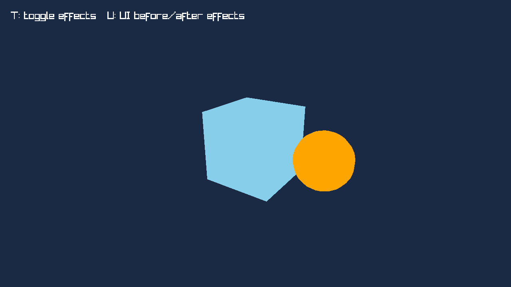
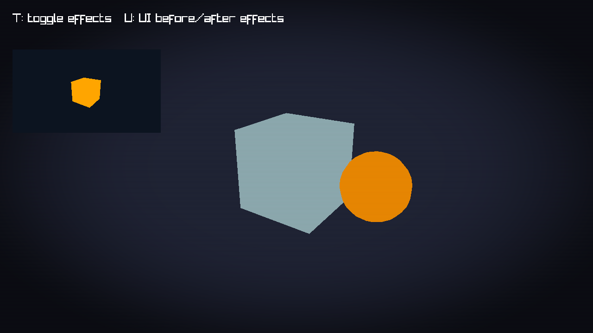

# Post-processing empty-chain comparison

Recorded 2026-10-04T13:19:21.391443+00:00 on 12th Gen Intel(R) Core(TM) i7-12700K, Linux-7.2.5-3-omarchy-x86_64-with-glibc2.44.
Release build: cargo 1.99.0 (5f94df478 2026-08-27); rustc 1.99.0 (b940084d7 2026-09-28).
Backend: X11/XWayland, NVIDIA Corporation / NVIDIA GeForce RTX 4070/PCIe/SSE2 / 3.3.0 NVIDIA 610.57.04.
Measured clean implementation revision: `6003a1c18ba26ee0a97d346d424c98101855147d`.

Command: `python3 scripts/post_processing_comparison.py --frames 5000 --repeats 7`.
Seven runs per mode at 1280×720, 960×540 reference size, native quality, no VSync
or FPS cap. Mode order rotates per repeat. The cube, sphere, diagonal line and
UI label are identical, and the script checks identical SDK submission counters.
Direct means the existing native offscreen/presentation path; empty explicitly
sets an empty post-processing chain during initialization. Neither submits effect
passes or creates effect intermediates. Both report one RGBA+depth world target.

| Mode | Frame median (ms) | Per-run frame range (ms) | Render median (ms) | Present median (ms) | Target estimate (MiB) |
| --- | ---: | --- | ---: | ---: | ---: |
| Direct (existing native offscreen path) | 0.08603 | 0.08290–0.09395 | 0.05383 | 0.03189 | 7.031 |
| Explicit empty chain | 0.08516 | 0.08269–0.08701 | 0.05285 | 0.03209 | 7.031 |

The empty/direct median ratio is 0.990×, within the
observed run variation. This shows no measurable added rendering cost for an
empty chain in this workload; it does not establish a speedup. Both modes use
the same rendering path in the new implementation, so this is a public-mode
comparison, not a before/after performance claim about the prior SDK revision.
Timings are uncapped CPU frame wall times including initial target allocation,
driver stalls and presentation, not GPU execution times or representative game FPS.
Frame, render and presentation medians are independent and need not add exactly.

The [full summary](post-processing-evidence/summary.json) records every sample,
settings, toolchain, revision, CPU/OS/backend and OpenGL driver metadata.
Re-run the command for the current checkout. These evidence files and the document
are added after the measured implementation commit.

[Direct/empty workload](post-processing-evidence/direct.png):

The example's effects mode adds a 3D preview target, color grade, vignette and
scanlines. Its preview and label remain outside the chain by default. This image
illustrates effect behavior and is not part of the direct/empty timing comparison.
Toggle effects with T and move UI before/after effects with U.

Native probes also check ordered shared-shader passes and premultiplied alpha,
both UI placements, Fit/Expand/IntegerFit, 1×/1.25×/2× simulated DPI, native and
2×+FXAA quality, 2D/3D contents, material sampling, blend-state restoration,
resize/toggle screenshot output, allocation bounds and explicit target cleanup.
The full native smoke suite passes on this display. Automated tests simulate DPI
through GPU target dimensions; live desktop monitor transitions are not automated.
